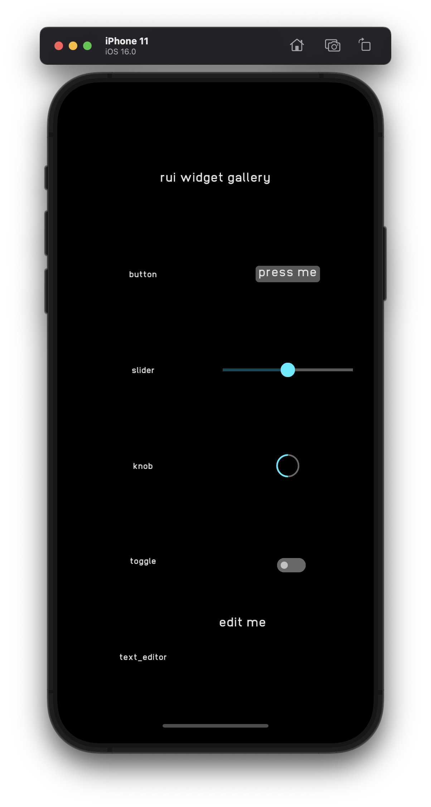

# rui-ios
Demo of [rui](https://github.com/audulus/rui) embedded on iOS

To run:

1. `rustup target add aarch64-apple-ios x86_64-apple-ios`
1. `cargo install cargo-lipo`
1. Open Xcode project
1. Run

